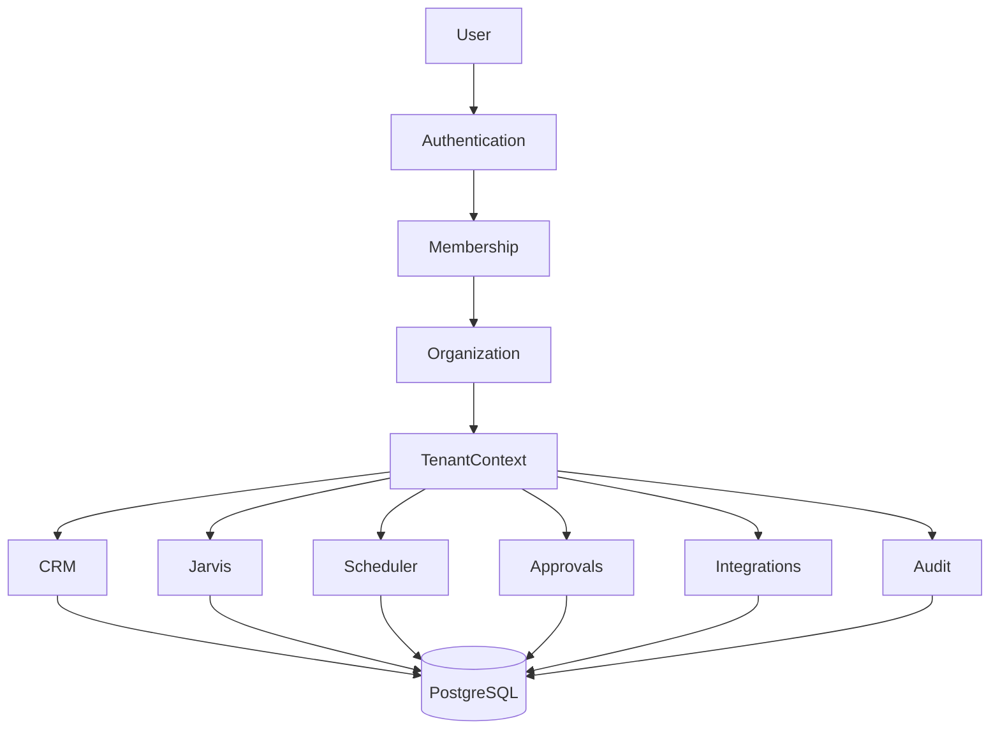

# LeadLens CareOS

An AI-powered multi-tenant business operating system for physiotherapy
clinics, wellness businesses, and other small service-based practices.

**Designed, built, migrated, tested, and deployed as an end-to-end AI
automation project using Claude Code and an agent-driven engineering
workflow.**

---

## Validation

Independently audited, adversarially tested, and verified clean against
the current codebase (`client-1` / `master`, commit `9bc067e`):

| Check | Result |
|---|---|
| pytest suite | **442 passed**, 0 failed, 0 skipped |
| Standalone script-style regression tests | **19 passed**, 0 failed |
| Alembic `upgrade head` | clean, no drift |
| Alembic `check` (model/migration drift) | clean |
| Alembic `downgrade base` → `upgrade head` cycle | clean |
| `pip-audit` (dependency vulnerabilities) | no known vulnerabilities |
| Repository secrets scan | clean |
| Adversarial multi-tenant isolation testing | passed (see [Engineering Journey](#engineering-journey)) |
| Backup / restore round-trip validation | passed |

Every one of these is re-run on every hardening pass in this repo's
history, not just once — see `docs/V2_PHASE9_PRODUCTION_HARDENING.md`
and its Phase 9.1 / 9.1.1 addenda for the full audit trail.

---

## Why LeadLens Exists

Small service businesses — physiotherapy clinics, wellness studios,
single-practitioner practices — run on the same repetitive operational
work: chasing no-shows, reminding patients about appointments, flagging
lapsed patients, watching for slow weeks, following up on leads. None of
that requires human judgment; all of it eats the owner's attention.

**Jarvis is the product.** He is an AI Chief of Staff who has a team of
specialist agents of his own, reasons over the business's real data, and
either acts (through a human-gated approval flow) or tells the owner
what needs their attention. The CRM — patients, appointments, treatment
packages, payments, therapists — is the operational substrate Jarvis
needs in order to actually do things for the business, not a product in
its own right.

LeadLens started as a single-clinic pilot built for **Beyond Pain**
(Malad, Mumbai) — the founder's own physiotherapy clinic, and still the
project's real-world proving ground. It has since been migrated,
incrementally and behind feature flags, into a multi-tenant SaaS
foundation: one application and one relational database capable of
serving many independent clinics, each with isolated data, credentials,
scheduling, and audit history.

---

## Core Product

The app has two linked workspaces, toggled from the sidebar via the
**Core switch**:

### CRM Workspace

Patients, appointments, treatment plans, follow-ups, a clinic dashboard,
payments, clinic team (therapists), and settings — the day-to-day
operational record a clinic runs on.

### Jarvis Workspace

Mission Control, Patient Intelligence, the AI team (specialist agents
synthesized into one voice), autonomous workflows, integrations, an
approval queue, and business memory (Data Hub / Reports / Memory
Center).

---

## High-Level Architecture



Every subsystem downstream of `TenantContext` — CRM, Jarvis, the
scheduler, approvals, integration credentials, and the audit log — reads
and writes through the same organization-scoped relational schema in
PostgreSQL (SQLite locally/in tests).

---

## Multi-Tenant SaaS Architecture

The relational schema (`core/db/models/`) and identity layer
(`core/identity/`) give every organization its own isolated:

- **Users, Memberships, Organizations** — a user can belong to more than
  one organization; a membership carries exactly one role.
- **RBAC** — a 7-role, permission-checked authorization model enforced
  at backend service boundaries (see [Authentication & RBAC](#authentication--rbac)).
- **`TenantContext`** — an immutable, per-request identity (organization
  id + actor type: USER / SYSTEM / SCHEDULER / AUTOMATION) that every
  tenant-owned write derives its organization from. There is
  deliberately no module-level mutable "current organization" global.
- **Organization-scoped CRM** — patients, appointments, treatment
  packages, and payments, keyed to an organization via composite foreign
  keys that make a cross-tenant reference structurally impossible (SQLite
  foreign-key enforcement is turned on explicitly for this reason).
- **Tenant-isolated Jarvis learning memory** — one organization's
  patterns and preferences are never visible to another's Jarvis.
- **Tenant-aware scheduler** — the 14 automation checks run once per
  active organization with automations enabled, each with its own
  `TenantContext`.
- **Tenant-scoped approvals and execution queues** — every prepared
  action is stamped with its resolving organization at creation time;
  execution later derives its context strictly from the queue item, never
  from an ambient default.
- **Per-organization encrypted integration credentials** — WhatsApp,
  Gmail, and Google Calendar credentials are Fernet-encrypted and scoped
  to one organization; resolution fails closed and never falls back to
  another organization's credentials.
- **Tenant-isolated audit logs** — security/audit events read and write
  scoped to the acting organization.
- **Organization-scoped onboarding** — an explicit, operator-run
  provisioning CLI (`scripts/provision_organization.py`) creates a new
  organization, its first OWNER user, and membership; it cannot be used
  to reach across into another organization.

```text
                    One LeadLens deployment
        ┌───────────────────────────────────────────┐
        │                                             │
        │   Clinic A (Organization)                  │
        │   ├─ Users / Memberships / Roles           │
        │   ├─ CRM: patients, appointments, payments │
        │   ├─ Jarvis learning memory                │
        │   ├─ Scheduler run + approvals + queue     │
        │   ├─ WhatsApp / Gmail / Calendar creds     │
        │   └─ Audit log                             │
        │                                             │
        │   Clinic B (Organization)                  │
        │   ├─ Users / Memberships / Roles           │
        │   ├─ CRM: patients, appointments, payments │
        │   ├─ Jarvis learning memory                │
        │   ├─ Scheduler run + approvals + queue     │
        │   ├─ WhatsApp / Gmail / Calendar creds     │
        │   └─ Audit log                             │
        │                                             │
        └───────────────────────────────────────────┘
              one application · one PostgreSQL database
        Clinic A can never read, write, or fall back into
                     Clinic B's data or credentials.
```

**Rollout discipline:** every multi-tenant mechanism above shipped as an
independently-defaulted-OFF feature flag, validated end-to-end (including
a genuine second-organization test with deliberately overlapping data)
before being considered production-ready. Rollback, for every phase, is
the same shape — an environment-variable kill switch, no destructive
database change required. See `CLAUDE.md`'s "V2 migration" section for
the flag-by-flag production recommendation.

---

## Authentication & RBAC

```text
Email + password
   → User                (core/identity — Argon2id password hashing)
   → Membership           (which organization(s) this user belongs to)
   → Organization
   → Role                 (one of 7, per membership)
   → Permissions          (resolved from the role)
   → TenantContext        (organization id + actor identity for this request)
```

Passwords are hashed with **Argon2id** (`argon2-cffi`,
`core/identity/password_service.py`) — the real, live login path when
`LEADLENS_V2_AUTH_ENABLED` is on (`core/auth.py` has two complete,
independently-selected login paths — legacy shared-password, unchanged,
or this one — never both valid in one session). A revalidated session
(`core.identity.session.AuthenticatedSession`) is checked against the
database on every access, so a disabled user, membership, or
organization loses access within one call, not indefinitely.

**Roles** (`core/db/models/identity.py::MembershipRole`):

- `OWNER`
- `ADMIN`
- `RECEPTIONIST`
- `PRACTITIONER`
- `FINANCE`
- `MARKETING`
- `VIEWER`

Authorization is enforced at backend service boundaries
(`services/authorization_guard.py::require_permission()`), not just in
the UI — CRM mutations, approval decide/execute, integration-credential
administration, and member management all gate through the same
7-step `authorize()` check against a 7-role, 25-permission model
(`core/identity/authorization_service.py`, `core/identity/permissions.py`).
An org's admin can never touch another organization's membership, and
the last active OWNER cannot be disabled or demoted.

---

## Jarvis

Jarvis reasons over a **privacy-filtered, grounded view of the real
business** (`services/jarvis_context.py`) — patient names, contact
details, and clinical notes are excluded from the LLM context; the model
receives aggregate business signals only. He never invents facts about
the business he's reasoning over.

A request is routed to one or more **specialist agents**
(`services/specialist_orchestration.py`, `services/agent_router.py`) —
Sales, Marketing, Finance, and others — each scoped to a focus area and
an **allowlist of read-only data tools** (`services/jarvis_tools.py`,
explicitly named "Allowlisted, read-only data tools" in its own
docstring). Specialist output is synthesized back into a single Jarvis
voice.

Jarvis does not call tools autonomously against arbitrary model-native
function-calling — the tool surface is a fixed, reviewed allowlist, and
anything that would act in the outside world goes through the approval
gate described below, not a direct model decision.

---

## AI Agent Orchestration

```text
User Request
   → Jarvis Coordinator            (services/specialist_orchestration.py)
   → Specialist Routing            (services/agent_router.py)
   → Allowlisted Business Tools    (services/jarvis_tools.py, read-only)
   → Specialist Output             (per-agent focus: sales, marketing, finance, ...)
   → Jarvis Synthesis              (one voice, grounded in real business data)
```

---

## Automation Architecture

```mermaid
flowchart LR
    Trigger --> Rule[Business Rule]
    Rule --> Prepare[Prepare Action]
    Prepare --> Validate
    Validate --> Dedup[Deduplicate]
    Dedup --> Approval
    Approval --> Queue[Execution Queue]
    Queue --> TC[TenantContext]
    TC --> Creds[Tenant Credentials]
    Creds --> Exec[Execution]
    Exec --> Audit
```



The scheduler (`scheduler/run_scheduled_checks.py`) runs 14 implemented
automation checks, each verified against the live repository:

- Appointment reminders
- Missed-appointment recovery
- Inactive-patient recovery
- New-patient recovery
- Birthday automation
- Google review requests
- Corporate lead automation
- Lead qualification alerts
- Low-booking alerts
- Capacity alerts
- Revenue monitoring
- Monthly business review
- Waiting-list automation
- Therapist schedule optimization

Every check runs the same shape: qualify a real business condition,
prepare an action, validate it, deduplicate it against anything already
in flight, queue it for human approval, and — once approved — execute it
through the resolved tenant's own integration credentials, with the
outcome recorded to the audit log. A broken check is isolated: one
check raising an exception never takes down the other 13
(`scheduler/run_scheduled_checks.py::_run_one_check()`).

---

## Tenant-Safe Execution

```text
Clinic A
   → Action A            (prepared, stamped with Clinic A's organization id)
   → Approval A           (a human at Clinic A approves)
   → Queue Item A          (execution queue row, organization-scoped)
   → TenantContext A        (derived strictly from the queue item, never ambient)
   → Credentials A            (Clinic A's own encrypted WhatsApp/Gmail/Calendar creds)
   → Execution A                (sends/books as Clinic A, never Clinic B)
```

Deduplication is organization-scoped: two organizations preparing
byte-identical provider/action/payload content are independent business
events, not the same event
(`services/integration_manager_v21.py::_fingerprint()` hashes
`organization_id + provider + action + payload`, not just the latter
three — see [Example: Agent-Driven Debugging](#example-agent-driven-debugging)
for the real defect this closed). Execution itself derives its
`TenantContext` strictly from the queue item's own stamped
`organization_id` — never from an ambient default — so a missing or
tampered organization id fails execution closed instead of silently
running as the wrong tenant.

---

## Integrations

- **WhatsApp Cloud API** (`integrations/whatsapp_service.py`)
- **Gmail** (`integrations/gmail_service.py`)
- **Google Calendar** (`integrations/calendar_service.py`)
- **OpenAI** (Responses API — Jarvis and the specialist agents)

WhatsApp, Gmail, and Calendar credentials are stored per organization
(`core/db/models/integration.py::OrganizationIntegration`), Fernet-
encrypted (`services/credential_encryption.py`) under a platform-level
master key — never stored in the database in plaintext, never returned
by any admin API. Resolution (`services/integration_credentials.py::resolve_credentials()`)
is **fail-closed**: a disabled or broken integration never falls back to
another organization's credentials, and a merely-absent tenant
credential falls back to the legacy environment-variable configuration
only for the one transitional/default organization, behind its own
independently-defaulted-OFF flag — every other organization gets
nothing rather than someone else's credentials. OpenAI/LLM credentials
remain platform-scoped by design, not tenant-specific.

Every adapter supports both a dry-run mode (safe by default) and a live
mode.

---

## CRM

The CRM has been migrated, in place and behind feature flags, from a
single global JSON-backed store to a relational, organization-scoped
schema (`core/db/models/clinic.py`). The migration mechanisms, all
implemented and tested:

- **Dual-write** (`services/relational_sync_service.py`) — every legacy
  CRM mutation shadow-writes into the relational tables; the legacy
  write remains authoritative and a shadow-write failure is recorded,
  never blocking or rolling back the legacy operation.
- **Backfill** (`scripts/backfill_v2_crm.py`) — brings existing legacy
  data into the relational schema.
- **Parity verification** (`scripts/verify_v2_crm_parity.py`,
  `scripts/verify_v2_crm_read_parity.py`) — confirms the two stores
  agree before any cutover.
- **Relational reads** (`services/crm_read_router.py`) — reads can be
  routed to the relational tables entity-by-entity, behind independent
  flags, with a shadow-compare mode for pre-cutover verification.
- **Tenant-aware writes** (`services/crm_tenant_writer.py`) — the write
  path that makes both read and write genuinely organization-scoped
  (`LEADLENS_V2_CRM_TENANT_AUTHORITATIVE_ENABLED`), rather than every
  organization sharing one global list.
- **Repair / resync** (`scripts/repair_v2_crm.py`) — reconciles drift
  between the two stores.

The legacy `memory_store` (`core/memory.py`) is **not** the CRM's sole
current source of truth — it remains the default-off fallback and the
rollback target, not the only implementation.

---

## Business Memory

Jarvis's learning memory (`services/jarvis_memory.py`,
`core/db/models/jarvis.py::JarvisLearningRecord`) is tenant-scoped: one
organization's Jarvis never learns from, or surfaces, another
organization's history. It reads/writes the relational schema as its
primary durable store, with the legacy `data/learning/learning_memory.json`
file kept permanently in sync for the transitional/default organization.

---

## Scheduler

`scheduler/run_scheduled_checks.py::resolve_scheduler_organizations()`
enumerates every ACTIVE organization with automations explicitly enabled
when multi-org scheduling is on; each of the 14 checks then runs once
per organization with its own explicit `TenantContext` passed through —
not a shared ambient one. Idempotency (never re-flagging the same
condition twice) is tracked per organization in the scheduler ledger, so
Organization A's alert history can never suppress or duplicate
Organization B's. Runs are triggered on a schedule via GitHub Actions
(`.github/workflows/scheduler-master.yml`), since Streamlit Cloud itself
has no background-job support.

---

## Audit & Security

- Argon2id password hashing (live login path)
- Backend RBAC enforcement (`services/authorization_guard.py`)
- 7-step tenant authorization (`core/identity/authorization_service.py`)
- Tenant-isolated CRM, Jarvis memory, and audit log
- Encrypted, organization-scoped integration credentials
- Fail-closed credential resolution (never a cross-tenant fallback)
- Test-time guard against ever touching a real production database
  (`tests/_bootstrap.py` strips `DATABASE_URL` before any test runs)
- Repository secrets scanning (pre-commit hook + this session's own scan)
- `pip-audit` dependency scanning
- Readiness/health checks (below)

---

## Production Hardening

- **Health checks** (`scripts/health_check.py`) — HEALTHY / DEGRADED /
  UNHEALTHY per subsystem, including per-organization, real-decryption-
  attempt-based credential health (not just flag intent).
- **Production readiness** (`scripts/production_readiness.py`) — a
  single PASS / WARN / FAIL aggregator covering configuration, health,
  integration credentials, migration drift, and tenant integrity in one
  command.
- **Config validation** (`core/config_validation.py`) — centralized,
  secret-free startup configuration checks.
- **Tenant-integrity checks** (`scripts/verify_multi_org_readiness.py`)
  — cross-org foreign-key checks, membership-orphan checks, shadow-sync
  health.
- **Backup / restore** (`scripts/backup_database.py`,
  `scripts/restore_validate.py`) — reuses `core.memory.backup_now()`
  rather than reimplementing it.
- **Migration checks** — Alembic upgrade/check/downgrade-upgrade cycle,
  run in CI on every push.
- **Operational diagnostics / structured logging**
  (`core/observability.py`) — error categories, run ids, a secret-
  redacting `log_event()`.
- **Dependency scanning** — `pip-audit`, run in CI.
- **Secrets scanning** — a pre-commit hook plus a repository-wide scan
  before every hardening pass.
- **Scheduler failure isolation** — a broken check never takes down the
  other 13 in the same run.
- **Integration health checks** — per-organization, per-provider,
  real-decryption-attempt credential health, distinguishing "not
  configured by choice" from "configured but broken."

---

## Engineering Journey

```text
Single-Clinic Architecture
   → Relational SaaS Schema             (Phase 0)
   → Users / Organizations / Memberships (Phase 1)
   → RBAC                                (Phase 1)
   → CRM Dual-Write                      (Phase 3)
   → Relational Read Cutover             (Phase 4)
   → TenantContext                       (Phase 5)
   → Tenant-Scoped Business Logic        (Phase 5)
   → Per-Organization Credentials        (Phase 6, 6.1, 6.1.1)
   → Tenant-Safe Approvals / Execution   (Phase 6.1, 6.1.1)
   → Live Authentication                 (Phase 7, 7.1, 7.1.1)
   → Multi-Org Onboarding                (Phase 8, 8.1)
   → Tenant-Aware Scheduler              (Phase 8.1)
   → Production Hardening                (Phase 9, 9.1, 9.1.1)
```

Each phase shipped incrementally, behind its own independently-defaulted
-OFF flag, with the previous behavior fully preserved as the rollback
target — never a rewrite. Every phase's own audit and, where warranted,
a focused corrective ".1"/".1.1" hardening pass are documented in
`docs/V2_PHASE0` through `V2_PHASE9_PRODUCTION_HARDENING.md`.

---

## How I Built LeadLens With AI Agents

Claude Code was used as the implementation agent for the entire V2
migration — not as an autocomplete tool, but as the engineer executing
detailed, scoped phase specifications.

```text
Define Problem / Outcome
   → Design Constraints + Acceptance Criteria
   → Phased Implementation Prompt
   → Claude Code Implements
   → Review
   → Independent Audit
   → Reproduce Defects
   → Focused Corrective Phase
   → Re-Audit
   → Commit / Deploy After Validation
```

**The key challenge was not getting AI to generate code. The challenge
was deciding whether the generated system was correct, secure,
tenant-safe, and operationally reliable enough to deploy.** Every phase
in this repository's history was followed by an independent audit
request, treated as adversarial rather than confirmatory — several of
those audits found real defects in the immediately-preceding phase's own
work, which were then reproduced, fixed in a scoped follow-up phase, and
re-audited before being trusted.

---

## Example: Agent-Driven Debugging

**Cross-tenant automation deduplication.**

The execution-queue deduplication fingerprint originally hashed only
`provider + action + payload`. Two organizations preparing the same kind
of action with the same payload shape (a real possibility — e.g. two
clinics' birthday automations both queuing "send WhatsApp template X to
patient Y" on the same day, with a coincidentally-similar payload) would
collide onto the same fingerprint, meaning the second organization's
action could be treated as a duplicate of the first's and silently
never queued.

```text
Before:  provider + action + payload              = fingerprint
After:   organization_id + provider + action + payload = tenant-safe fingerprint
```

The fix (`services/integration_manager_v21.py::_fingerprint()`) adds
`organization_id` to the hashed identity, so two organizations preparing
byte-identical content are correctly treated as independent business
events. The bug was reproduced with a two-organization adversarial test,
fixed, regression-tested, and re-audited before being merged.

Other real defects found by this same audit-then-fix discipline, in this
repository's own history:

- **Tenant-unsafe audit-log reads** — the audit-log reader answered from
  a single legacy global log regardless of which organization was
  logged in, despite the underlying table already being organization-
  scoped; fixed behind its own flag.
- **Scheduler tenant-context gaps** — per-organization *enumeration*
  worked, but the 14 check functions' own execution content did not yet
  receive an explicit `TenantContext`; fixed by threading one through
  every check.
- **Credential-health false negatives** — a broken integration
  credential belonging to a non-default organization, or one already
  marked `ERROR` by a real failed live send, could be reported healthy
  by the production readiness command; fixed across two focused
  corrective passes.
- **Reload-token logout edge case** — a session-continuity token minted
  just before logout could still silently restore the session
  afterward, within its own short TTL; fixed with an explicit logout
  epoch.
- **Onboarding authorization gap** — first-run company setup called an
  ungated legacy save function directly, bypassing the RBAC gate every
  other settings write already required; fixed by routing onboarding
  through the gated path.

---

## Validation

The numbers above in one place, with more detail:

- **442 pytest tests** — 0 failed, 0 skipped, covering every migration
  phase (Phase 0 through 9.1.1), including dedicated adversarial
  multi-tenant isolation suites (a cannot read/write b's data, cannot
  use b's credentials, cannot approve/execute b's queue items, cannot
  access b's audit trail, cannot influence b's scheduler run),
  credential-failure tests (missing key, wrong key, corrupted
  ciphertext, already-`ERROR` credentials), approval/execution-queue
  ownership tests, session-tampering and reload-token isolation tests,
  and scheduler A→B→A interleaving tests.
- **19 standalone script-style regression tests** — the pre-pytest
  automation/scheduler test suite, still run on every change.
- **Alembic** — clean upgrade from empty, clean `alembic check` (no
  model/migration drift), clean downgrade-to-base/upgrade-to-head cycle.
- **`pip-audit`** — no known vulnerabilities in the pinned dependency
  set.
- **Secrets scan** — clean across every tracked file.
- **Backup / restore** — a full round-trip validated
  (`scripts/backup_database.py` → `scripts/restore_validate.py`).

---

## Tech Stack

**Application**
- Python
- Streamlit

**AI**
- OpenAI Responses API (Jarvis, specialist agents)
- Claude Code — the development workflow this project was built with

**Data**
- PostgreSQL (production)
- SQLAlchemy 2.x
- Alembic
- SQLite (local development and test isolation)

**Integrations**
- WhatsApp Cloud API
- Gmail
- Google Calendar

**Engineering / Operations**
- Docker (`Dockerfile`, `docker-compose.yml`)
- GitHub Actions (CI, plus scheduled scheduler runs)
- pytest
- pip-audit
- Backup/restore and health/readiness tooling (`scripts/`)

**Utilities**
- pandas
- openpyxl
- python-docx

---

## Local Setup (Windows)

```powershell
python -m venv .venv
.venv\Scripts\activate
pip install -r requirements.txt
copy .env.example .env
python -m streamlit run app.py
```

Then fill in `.env` — see `.env.example` for every variable and what
each one does. At minimum, set `OPENAI_API_KEY` for AI features to work.
Set `APP_PASSWORD` before putting any real clinic data behind a shared
URL (the legacy shared-password gate remains the default until
`LEADLENS_V2_AUTH_ENABLED` is explicitly turned on for a deployment —
see [Authentication & RBAC](#authentication--rbac)).

## Running Tests

Install dev dependencies first (adds `pytest` on top of the app's own
requirements):

```powershell
pip install -r requirements-dev.txt
```

Most of `tests/` is pytest-style and runs with:

```powershell
python -m pytest tests/
```

A subset of `tests/` (scheduler and automation checks) are standalone
scripts rather than pytest functions — run each directly from the
project root with the root on `PYTHONPATH`:

```powershell
$env:PYTHONPATH = "."
python tests\test_scheduler.py
```

(Every file under `tests/` imports `tests/_bootstrap.py` first, which
guarantees a test can never accidentally reach a real production
database even if `DATABASE_URL` is set in `.env`.)

## Project Structure

```text
app.py              Entry point: login gate, then CRM or onboarding
dashboard.py        Workspace router — the Core switch, CRM/JARVIS nav
onboarding.py       First-run clinic setup
core/               Legacy business memory, live auth gate, config
  db/               V2 relational schema — models, session handling
  identity/         Users, orgs, memberships, RBAC, sessions, TenantContext
services/           AI connector, specialist orchestration, Jarvis context,
                    integration/approval manager, learning memory, CRM
                    migration mechanisms, credential encryption
ui/                 CRM and JARVIS screens (workspace_theme.py owns the
                    locked Core-switch/theme CSS)
integrations/       WhatsApp, Gmail, Google Calendar — dry-run and live
scheduler/          14 tenant-aware background automation checks
scripts/            Migration, backfill, repair, verify, backup/restore,
                    health/readiness, and organization-provisioning tools
alembic/            Relational schema migrations
workflows/          Autonomous workflow definitions
marketing-site/     Static public marketing site + lead-capture endpoint
database/           Local SQLite file and JSON fallbacks (gitignored)
data/               Runtime data: security audit log, collaboration, learning
generated/          Generated documents (gitignored)
tests/              Regression tests (pytest + standalone scripts)
docs/               V2 migration design docs (per phase), runbooks
```

## Deployment

The app reads all configuration from environment variables (see
`.env.example`). Confirmed, currently-supported deployment paths:

- **Streamlit Community Cloud** — push to GitHub, point a new app at
  `app.py`, set secrets (`OPENAI_API_KEY`, `APP_USER_ID`,
  `APP_PASSWORD`, `DATABASE_URL` — required here, since the platform's
  filesystem is ephemeral).
- **Docker** (self-hosted or any container platform) — `docker compose
  up --build`, or build the included `Dockerfile` directly; exposes port
  `8501`.
- **Render / Railway** — both build directly from the included
  `Dockerfile`.
- **Managed PostgreSQL** (Supabase, Neon, or any Postgres-compatible
  host) via `DATABASE_URL` — required for any deployment whose
  filesystem does not persist between restarts.

## Multi-Organization Deployment Model

The V2 architecture is designed around:

```text
One application
   + One relational database
      → Organization A
      → Organization B
      → Organization C
```

with isolated users, CRM data, Jarvis memory, scheduler runs, approvals,
execution queue items, audit logs, and integration credentials per
organization — not a copy of the application per client.

A fully separate deployment (own branch, own database, own app) per
client remains a supported, sometimes deliberate choice — e.g. for a
client who wants total infrastructure isolation — but it is **not** the
default SaaS model going forward.

## Demo

A live demo exists separately from this repository and requires
authentication. No public URL, credentials, or real clinic/patient data
are included here — reach out for access.

## Known Scope Boundaries

The foundational V2 migration — relational schema, identity/RBAC, CRM
dual-write and read cutover, tenant-scoped business logic,
per-organization credentials, tenant-safe approvals/execution, live
authentication, multi-org onboarding, a tenant-aware scheduler, and
production hardening — **is complete**, tested, and independently
audited end-to-end. What is intentionally not built yet, because it is
product/commercialization work rather than migration work:

- Public self-service signup
- Billing / subscriptions
- Polished onboarding UX
- Enterprise SSO / social login
- Broader integrations beyond WhatsApp, Gmail, and Calendar
- Deeper Jarvis autonomy and analytics
- Enterprise-grade infrastructure isolation (e.g. per-tenant database
  sharding)

Some legacy compatibility paths remain in place on purpose — the
original shared-password login, the legacy `memory_store`, and the
environment-variable integration-credential fallback — each gated behind
its own independently-defaulted-OFF flag, kept specifically as a tested
rollback target rather than dead code.

## Current Status

LeadLens is no longer the original single-clinic pilot it started as.
The current codebase is a tested, audited multi-tenant SaaS foundation:

- Multi-tenant relational schema with organization-scoped isolation
- Real per-user authentication (Argon2id) with backend RBAC
- Organization-scoped CRM, with a completed dual-write/read-cutover
  migration path off the legacy store
- Tenant-aware Jarvis (grounded context, specialist routing, allowlisted
  tools, isolated learning memory)
- Tenant-aware scheduler (14 automations, per-organization execution)
- Tenant-safe approvals and execution queues with organization-scoped
  deduplication
- Encrypted, per-organization integration credentials with fail-closed
  resolution
- Tenant-isolated audit logging
- Operator-run SaaS organization onboarding
- Production readiness, health checks, backup/restore, and CI-enforced
  security validation (pip-audit, secrets scanning, Alembic drift
  checks)

The next stage of work is **product validation and onboarding additional
clinics** — not foundational migration work.
